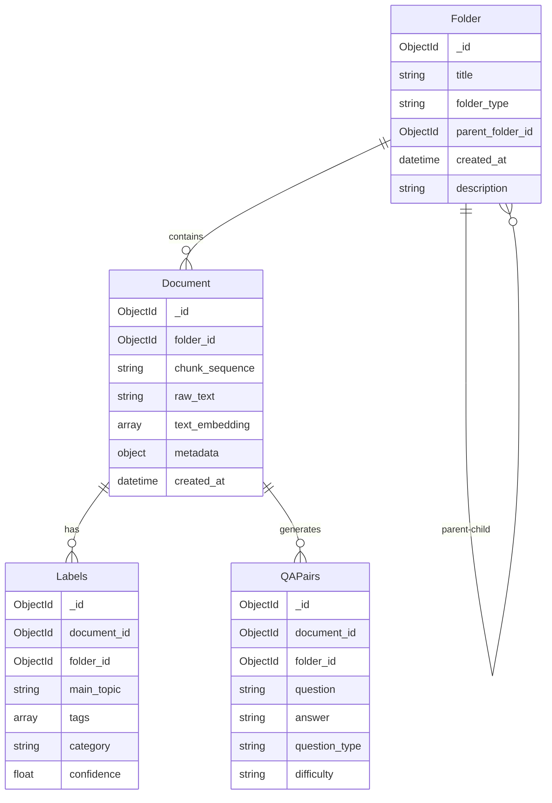

# RAG System v2.0 - MongoDB 통합 벡터 데이터베이스

## 🚀 v2.0 업데이트 (2024-12-19)

> **중요**: 이 시스템은 v2.0으로 업그레이드되어 **MongoDB 기반 통합 벡터 데이터베이스**를 사용합니다.
> 기존 FAISS/Chroma에서 MongoDB 중심의 하이브리드 검색 시스템으로 전환되었습니다.

### ✨ v2.0 주요 변경사항
- **MongoDB 통합**: 문서, 라벨, QA, 폴더를 단일 데이터베이스에서 관리
- **계층적 폴더 구조**: folder_id 기반 관계형 데이터 관리
- **하이브리드 검색**: 텍스트 + 벡터 + QA + 태그 통합 검색
- **향상된 스키마**: Document, Labels, QAPairs, Folder 컬렉션으로 재구성
- **호환성 유지**: 기존 API 코드와 100% 호환

## 📋 아키텍처 요약

본 프로젝트는 GPT-4와 LangChain/FastAPI를 활용한 차세대 RAG(Retrieval Augmented Generation) 시스템입니다.

### 🏗️ 주요 구성 요소
- **문서 처리**: 문서 로딩, 클렌징, 청킹, 폴더 관리
- **임베딩 생성**: OpenAI Embedding API를 통한 벡터화
- **MongoDB 벡터 스토어**: 통합 벡터 검색 및 메타데이터 관리
- **자동 라벨링**: GPT-4 기반 토픽, 태그, 카테고리 분류
- **QA 생성**: 자동 질문-답변 생성 및 난이도 분류
- **하이브리드 RAG**: 컨텍스트 + 벡터 + QA 통합 검색
- **API 서버**: FastAPI 기반 RESTful API

### 🗄️ v2.0 데이터베이스 스키마



## 🛠️ 설치 및 설정

### 1. 환경 설정
```bash
# Python 3.9+ 권장
python -m venv venv
source venv/bin/activate  # Windows: venv\Scripts\activate

# 의존성 설치
pip install -r requirements.txt
```

### 2. 환경 변수 설정
```bash
cp .env.example .env
# .env 파일 편집하여 API 키 설정
```

**.env 파일 예시:**
```env
# OpenAI API
OPENAI_API_KEY=your-openai-api-key

# MongoDB 설정
MONGODB_URI=mongodb://localhost:27017
DATABASE_NAME=rag_system

# API 설정
API_HOST=0.0.0.0
API_PORT=8000
```

### 3. 데이터베이스 초기화
```bash
# MongoDB 컬렉션 및 인덱스 생성
python scripts/setup_db.py

# 인덱스 생성 (필요시)
python scripts/create_indexes.py
```

## 📖 사용법

### 1. 폴더 및 문서 관리
```python
from src.utils.database_v2 import MongoDBClientV2

# 클라이언트 초기화
db = MongoDBClientV2("mongodb://localhost:27017")

# 폴더 생성
folder_id = db.create_folder(
    title="제품 매뉴얼",
    folder_type="documentation",
    description="모든 제품 사용 설명서"
)

# 문서 삽입
doc_id = db.insert_document(
    folder_id=folder_id,
    raw_text="이것은 제품 사용법입니다...",
    chunk_sequence="manual_001",
    text_embedding=[0.1, 0.2, ...],  # OpenAI 임베딩
    metadata={"source": "manual.pdf", "page": 1}
)
```

### 2. 하이브리드 검색
```python
# 통합 검색 (텍스트 + QA + 태그)
results = db.hybrid_search(
    query="제품 사용법",
    folder_id=folder_id,
    k=5
)

print(f"텍스트 결과: {len(results['text_results'])}개")
print(f"QA 결과: {len(results['qa_results'])}개")
print(f"태그 결과: {len(results['tag_results'])}개")
```

### 3. 벡터 검색
```python
from src.embedding.vectorstore_v2 import MongoVectorStore

# 벡터 스토어 초기화
vector_store = MongoVectorStore(db)

# 유사도 검색
query_embedding = embedder.embed_query("제품 보증 기간")
similar_docs = vector_store.similarity_search(
    query_embedding, 
    folder_id=folder_id, 
    k=5
)
```

### 4. 문서 처리 파이프라인
```bash
# 새로운 v2 파이프라인으로 문서 처리
python scripts/process_documents.py \
    --input data/raw \
    --folder-title "신규 문서" \
    --folder-type "general"
```

### 5. API 서버 실행
```bash
python scripts/run_server.py
# 또는
uvicorn src.api.main:app --reload --host 0.0.0.0 --port 8000
```

## 🌐 API 엔드포인트

### v2.0 새 엔드포인트
- `POST /v2/query`: 하이브리드 검색 기반 질의응답
- `POST /v2/folders`: 폴더 생성
- `GET /v2/folders/{folder_id}/stats`: 폴더 통계
- `POST /v2/documents`: 문서 업로드
- `GET /v2/search`: 통합 검색

### 기존 호환 엔드포인트
- `POST /query`: 사용자 질문 처리 (v1 호환)
- `POST /embed`: 문서 임베딩 생성
- `GET /health`: 서버 상태 확인

### API 사용 예시
```bash
# v2 하이브리드 검색
curl -X POST http://localhost:8000/v2/query \
  -H "Content-Type: application/json" \
  -d '{
    "query": "환불 정책은 무엇인가요?",
    "folder_id": "677f1234567890abcdef1234",
    "search_type": "hybrid"
  }'

# 응답 예시
{
  "answer": "환불은 구매일로부터 7일 이내 가능합니다...",
  "sources": {
    "text_results": [...],
    "qa_results": [...],
    "tag_results": [...]
  },
  "metadata": {
    "processing_time": 1.23,
    "search_type": "hybrid",
    "total_results": 15
  }
}
```

## 🗂️ 프로젝트 구조

```
rag-system/
├── src/
│   ├── data_processing/     # 문서 처리 모듈
│   ├── embedding/          
│   │   ├── embedder.py     # OpenAI 임베딩
│   │   └── vectorstore_v2.py # MongoDB 벡터 스토어
│   ├── labeling/           # 자동 라벨링
│   ├── retrieval/          # RAG 검색 엔진
│   ├── api/                # FastAPI 서버
│   └── utils/
│       ├── database.py     # v1 호환 레이어
│       ├── database_v2.py  # v2 MongoDB 클라이언트
│       └── schemas.py      # v2 스키마 정의
├── scripts/
│   ├── migration_v2.py     # v1→v2 마이그레이션
│   ├── simple_cleanup.py   # 데이터 정리
│   ├── create_indexes.py   # 인덱스 생성
│   └── process_documents.py # 문서 처리
├── config/
│   ├── database_config.py  # v2 데이터베이스 설정
│   └── settings.py         # 앱 설정
└── tests/
    └── test_migration.py    # 마이그레이션 테스트
```

## 🔧 마이그레이션 가이드

### v1에서 v2로 업그레이드
```bash
# 1. 백업 생성 (자동)
python scripts/migration_v2.py

# 2. 기존 데이터 정리 (선택사항)
python scripts/simple_cleanup.py

# 3. 인덱스 생성
python scripts/create_indexes.py

# 4. 마이그레이션 테스트
python tests/test_migration.py
```

### 호환성 확인
```python
# 기존 코드는 그대로 작동
from src.utils.database import MongoDBClient

db = MongoDBClient("mongodb://localhost:27017")
chunks = db.get_all_chunks()  # v2 Document로 자동 변환
results = db.find_by_labels(["AI", "기계학습"])  # v2 Labels 검색
```

## 🚀 성능 최적화

### v2.0 개선사항
- **인덱스 최적화**: 
  - folder_id, tags, category별 인덱스
  - 텍스트 검색 및 벡터 검색 인덱스
- **배치 처리**: 대용량 임베딩 배치 업데이트
- **계층적 캐싱**: 폴더 레벨 결과 캐싱
- **하이브리드 검색**: 다중 소스 통합으로 정확도 향상

### 권장 설정
```python
# config/database_config.py
DatabaseConfig(
    vector_dimension=1536,        # OpenAI embedding
    batch_size=100,              # 배치 처리 크기
    max_connections=50,          # 커넥션 풀 크기
    vector_similarity_threshold=0.7  # 유사도 임계값
)
```

## 📊 모니터링 및 통계

```python
# 폴더별 통계 조회
stats = db.get_folder_statistics(folder_id)
print(f"문서: {stats['document_count']}개")
print(f"라벨: {stats['label_count']}개")
print(f"QA: {stats['qa_count']}개")

# 전체 시스템 통계
all_stats = db.get_all_folder_stats()
for stat in all_stats:
    print(f"{stat['folder_title']}: {stat['document_count']}개 문서")
```

## ⚠️ 주의사항

- **MongoDB 필수**: v2.0부터 MongoDB가 필수 의존성입니다
- **API 키 관리**: OpenAI API 사용량 모니터링 필요
- **메모리 관리**: 대용량 임베딩 처리 시 배치 크기 조정
- **인덱스 관리**: 정기적인 인덱스 최적화 권장

## 🆘 트러블슈팅

### 자주 발생하는 문제
```bash
# MongoDB 연결 오류
# → .env 파일의 MONGODB_URI 확인

# 인덱스 오류
python scripts/create_indexes.py

# 마이그레이션 문제
python tests/test_migration.py

# 성능 문제
# → config/database_config.py에서 batch_size 조정
```

## 🤝 기여하기

1. Fork the repository
2. Create feature branch (`git checkout -b feature/amazing-feature`)
3. Commit changes (`git commit -m 'Add amazing feature'`)
4. Push to branch (`git push origin feature/amazing-feature`)
5. Open a Pull Request


---